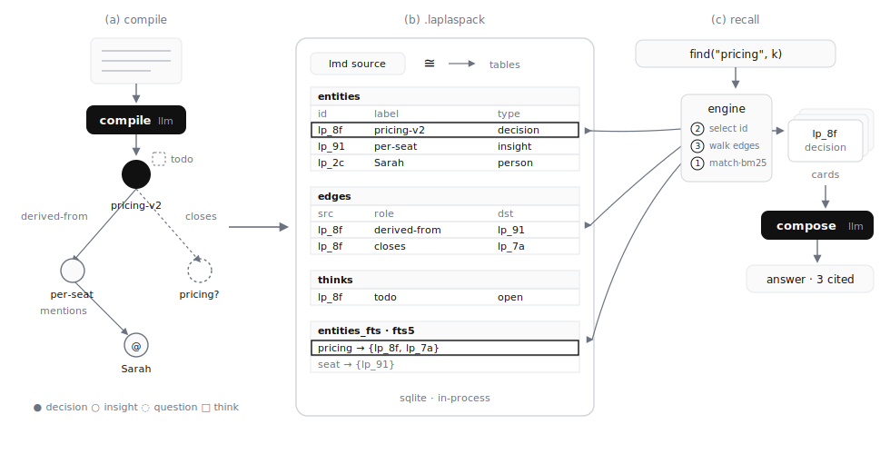

# The Laplas Method — a short technical report

> How a thought becomes a queryable, portable memory — and how an agent asks
> for it back. This is the narrative companion to the normative documents:
> [SPEC](./SPEC.md) (the container) · [RECALL](./RECALL.md) (the query surface)
> · [VERSIONING](./VERSIONING.md) (the compatibility pledge).



**Figure 1.** (a) `compile` turns free text into a typed graph. (b) The graph
materializes as relational tables inside one `.laplaspack` file; the LMD source
and the tables are isomorphic. (c) `find()` executes as deterministic SQL and
graph hops over those tables; `compose` cites the returned cards. The LLM
appears only in the two black boxes.

---

## 1. The claim

Retrieval-augmented systems structure knowledge **at read time**: a query
arrives, an embedding search guesses what is relevant, and a model interprets
the guess. Laplas moves the interpretive work to **write time**: a language
model acts as a *parser* exactly once — when the thought is captured — and
everything after that is deterministic.

Two consequences follow:

1. **The decomposition is the search substrate.** A thought captured as a
   typed node with properties and causal links needs no re-interpretation to
   be found — `type=decision`, `derived-from`, `status=open` are query axes,
   not prompt hints.
2. **The model is confined to two edges.** `compile` (text → atoms) and
   `compose` (cards → prose). The middle — storage, indexing, retrieval,
   traversal — is ordinary, inspectable machinery.

## 2. Write: the compile edge

Input is anything a person produces: a chat message, a note, a document. The
compiler (an LLM constrained by the workspace **schema** — the grammar) emits
LMD, a plain-text markup:

```
[[* pricing-v2]]  >>id: lp_8f3a
>>type: decision
>>derived-from: [[^ per-seat-punitive]]
>>closes: [[? what-pricing-model]]
@@todo on="pricing-v2" by=A at=2026-07-04 … @@
```

Four kinds of atoms: **nodes** (typed entities), **properties** (scalar
fields), **links** (typed, causal — six roles), **thinks** (dated human
thoughts attached to a host node). Authored `>>id:` anchors give every atom a
stable identity that survives rebuilds and renames.

## 3. Own: the isomorph

A `.laplaspack` is a single SQLite file holding **two faces of the same
memory**:

- `lmd_source` — the canonical, human-readable text;
- derived tables — `entities`, `edges`, `thinks`, `entities_fts` (FTS5),
  `sparse_postings`, plus `manifest` and `commits` provenance.

The two are **isomorphic** by contract:
`pack(parse(lmd)).hydrate() ≅ graph(parse(lmd))` ([SPEC §5](./SPEC.md)). The
tables can always be rebuilt from the text — which is why version upgrades are
a rebuild, not a migration script ([VERSIONING §1](./VERSIONING.md)), and why
the file stays readable even if every implementation disappears. Packs are
Ed25519-signable and move as ordinary files.

## 4. Read: SQL, then a graph walk

Recall is **navigation, not generation**. `find("pricing")` executes, in
process, over the pack's own tables:

```sql
-- ① lexical candidates, ranked
SELECT id, label FROM entities_fts
 WHERE entities_fts MATCH '"pricing" OR …'
 ORDER BY bm25(entities_fts);

-- ② open the survivors
SELECT * FROM entities WHERE id IN (…);

-- ③ walk the causal neighborhood
SELECT dst, role FROM edges WHERE src = 'lp_8f3a';
```

(Learned-sparse and dense layers add candidates when present; they change
*ranking*, never *membership*.) Typed operators — `match(type=…)`,
`expand(id)`, `recall_why(id)`, the thinks layer — are specified in
[RECALL](./RECALL.md). The result is a bounded set of **cards**: id, label,
type, properties, provenance. Cards, not raw text, are what the `compose` step
receives — so every sentence in the final answer carries a node id it can be
checked against, and "6 cited · of 10 explored" falls out of the operator log
for free.

Hydrating a pack (open → hot index) takes single-digit milliseconds; there is
no re-parse on the read path.

## 5. Write-back: the human gate

Agents never write memory directly. A run may **stage** a commit
(`propose_commit`); a person approves it; only then does it land in the source
— and the tables follow, because of §3. Memory grows, but only through hands.

## 6. What is deliberately absent

- No whole-source dump operator — export is a *file* operation, not recall.
- No writes through the query surface.
- No hidden state: everything an answer used is in the pack, offline-checkable
  with the zero-dependency [reader](./laplaspack_reader.py).

## 7. Status

The reference engine implements everything above and serves it in production
(the Laplas desktop app, the AX console, and the Manifesto embed all read
packs through this exact path). The format, grammar, reader, writer, seal, and
merge tools in this repository are the public, reimplementable surface.
